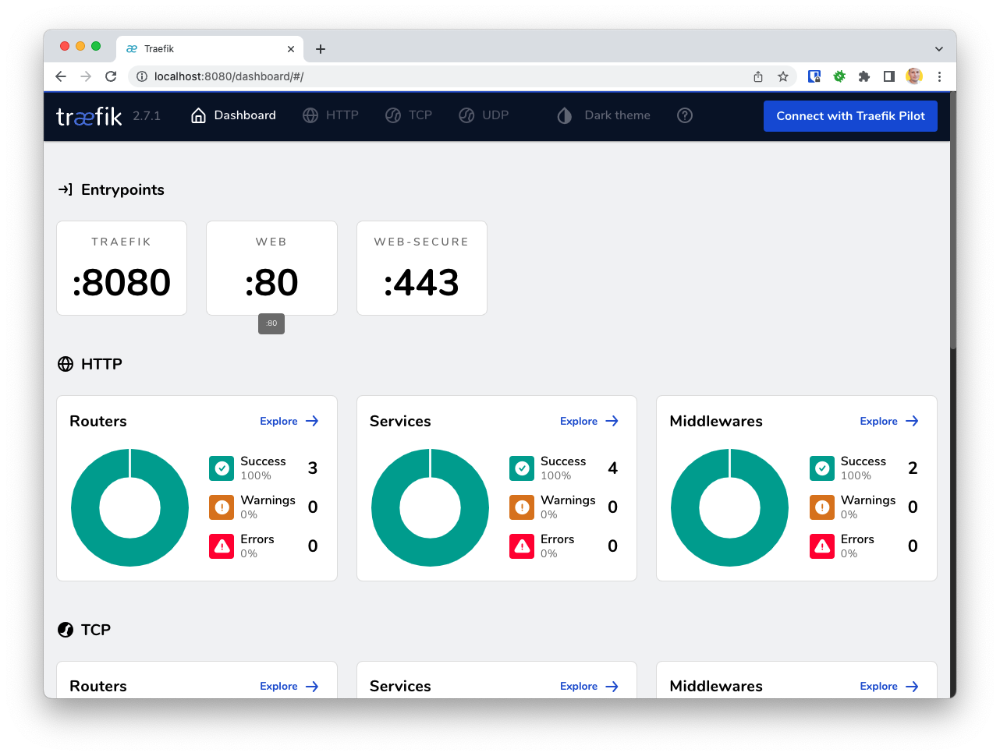
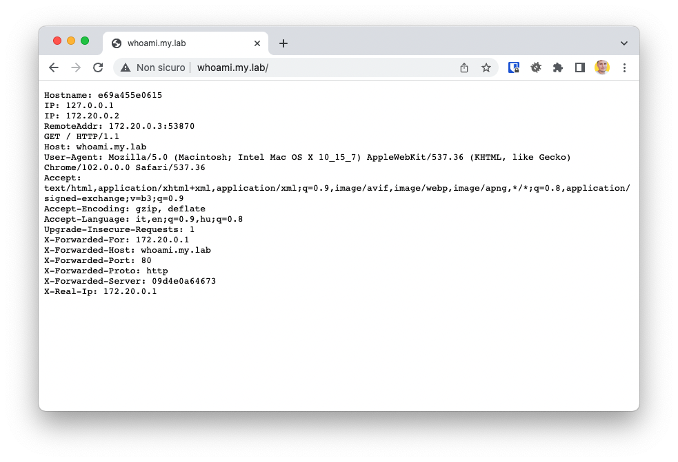

Traefik is a reverse proxy write in go with the good performance and functions.
It is fast, and it is used on all modern applications like kubernetes ad so on.

Traefik is design to be integrated with docker in a few line of configuration and can
automatically expose the container routes.

Let's start installing and configuring the traefik service.

## Install

There are different ways to set up *Traefik*.
For me the best and fast way is use docker or docker-compose.

First create a *docker-compose.yml* file.

```yaml
version: '3.7'

services:
  traefik:
    image: traefik:latest
    ports:
      - 80:80
      - 443:443
      - 8888:8888
    volumes:
      - ./config/traefik:/etc/traefik
      - /var/run/docker.sock:/var/run/docker.sock
```

## Configure

Create *traefik.yml* into configuration folder

```yaml
entrypoints:
  web:
    address: ":80"

  web-secure:
    address: ":443"

  internal:
    address: ":8888"

providers:
  docker:
    endpoint: unix:///var/run/docker.sock
    watch: true
    exposedByDefault: false

api:
  dashboard: true
  insecure: true

# Optional
metrics:
  prometheus:
    entryPoint: web
```

With this configuration you can configure three entrypoints:

- `web` on port 80
- `web-secure` on port 443
- `internal` on port 8888 (it's use for dashboard)

Next you define `docker` provider. You can use more and different providers like a `file` for
external service not handled by docker

## Dashboard

Now you can run *docker-compose* and navigate to `http://localhost:8888`. 
If all ar correct you must see the administration dashboard



## Secure it

The dashboard is now open, and anyone can access them. Let's go to secure it.
First change the *traefik.yml* configuration file

```yaml
api:
  dashboard: true
  insecure: false
```

Generate user and password for the basic auth with the command

```bash
htpasswd -nbB <username> <password>
```

For example

```bash
> htpasswd -nbB admin admin
< admin:$2y$05$d98bSQ3mPvuuB/yC2lCtG.qnu/Ghb5bEfXMtcbwevl24dFsz0l2j2
```

With the basic auth credential we can change the *docker-compose.yml* and add labels into traefik service:

```yml
services:
  traefik:
    ...

    labels:
      traefik.enable: true
      traefik.http.routers.traefik.rule: Host(`traefik.$MY_DOMAIN`)
      traefik.http.routers.traefik.service: api@internal
      traefik.http.routers.traefik.entrypoints: web
      traefik.http.routers.traefik.middlewares: "traefik-auth"
      traefik.http.middlewares.traefik-auth.basicauth.users: "admin:$2y$05$d98bSQ3mPvuuB/yC2lCtG.qnu/Ghb5bEfXMtcbwevl24dFsz0l2j2"
```

Warning: in the last *docker-compose.yml* changes we use the environment variable **$MY_DOMAIN**.
This is a dns name that point to your traefik service.

Now if you access to `http://traefik.$MY_DOMAIN` you must login with basic auth before access to dashboard

## Use traefik

The last step is test traefik service.
To instruct traefik you can use *labels* inside docker-compose file.

For example deploy a service and expose it:

```yaml
version: '3.7'

services:
  whoami:
    image: containous/whoami:latest
    labels:
      - traefik.enable=true
      - traefik.http.routers.whoami.rule=Host(`whoami.$MY_DOMAIN`)
```

and open `http://whoami.$MY_DOMAIN`



🎉 Happy proxing